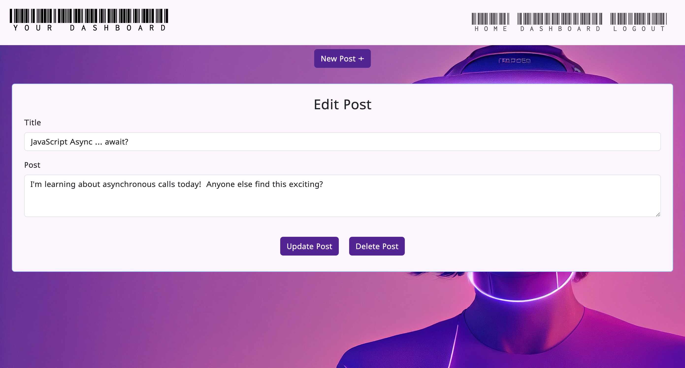
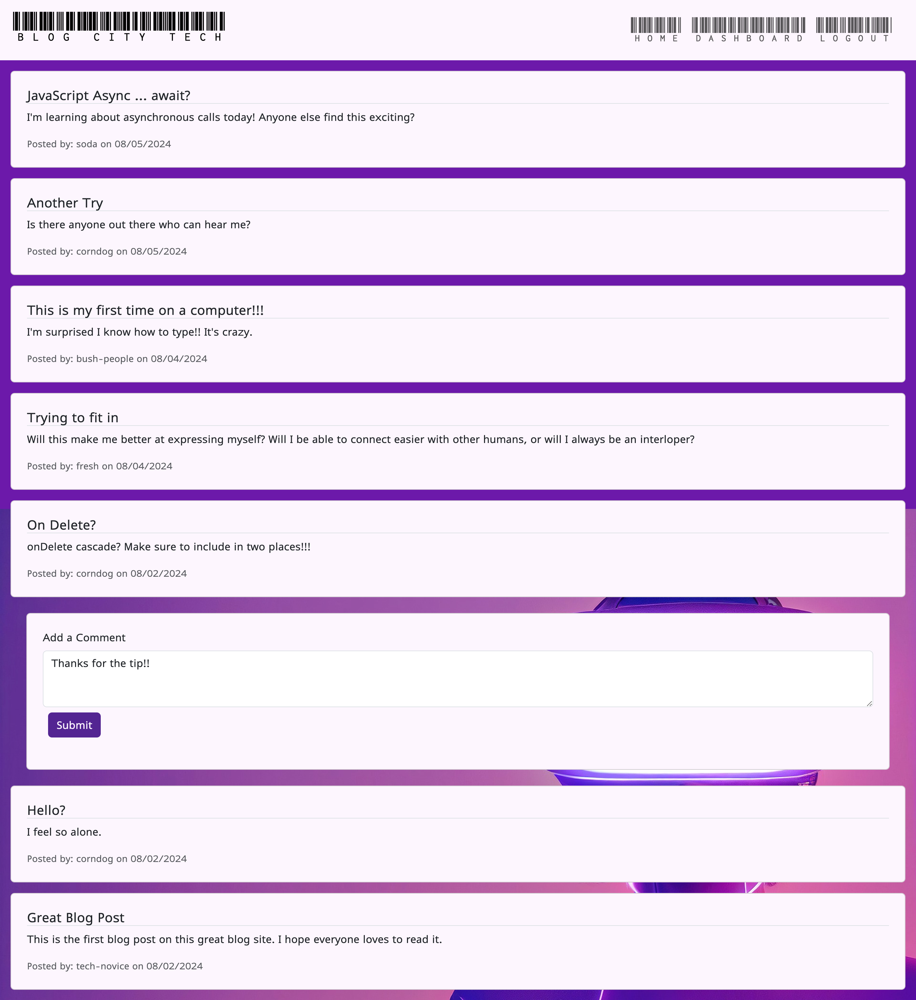

# blog-city-tech

## Description
A CMC style blog using Express.js, Handlebars.js, and Sequelize to connect to a postgreSQL database where users can blog.  If a user would like to participate they can create a free account and sign in to write posts of their own and comment on existing posts.  While logged in, users can also make edits to their own posts or choose to delete them.  Deleting the posts will delete any associated comments with them.  A great, simple communication tool to spread the word of tech, blog-city style!

## Table of Contents
* [Installation](#installation)
* [Usage](#usage)
* [License](#license)
* [Contributing](#contributing)
* [Credits](#credits)
* [Tests](#tests)
* [Questions](#questions)

## Installation
Installation instructions for application:
No dependencies needed, just navigate to the deployed application to begin using.

## Usage
Click [here]() to view deployed application.

Using the project is simple.  Upon navigating to the link above the user is presented with the homepage, where they can view existing blog posts and click on them to view comments.  Beyond that, the user must log in to be able to see the rest of the content or create their own.  Attempting to go to the dashboard page will automatically direct the user to the login page, where they can either enter existing credentials or sign up with a new username or password instead.  Either option will result in the user being successfully logged in and directed to their own personal dashboard, where they can view, if any, existing posts they have made and have an option to create a new post. From the dashboard, users can click on existing posts and make edits or choose to delete posts of their own, or they can navigate back to the homepage and choose to interact with and comment on other posts.  Commenting on a post takes the user to the post's own specific page, where they can view the comment they submitted as well as any other comments by other users.

## License
This project is operating under the MIT license.  For more detailed information, please click [here](https://opensource.org/license/mit).

## Contributing
See contact information below to contact me.

## Credits
Image by <a href="https://pixabay.com/users/brianpenny-29844978/?utm_source=link-attribution&utm_medium=referral&utm_campaign=image&utm_content=7499159">Brian Penny</a> from <a href="https://pixabay.com//?utm_source=link-attribution&utm_medium=referral&utm_campaign=image&utm_content=7499159">Pixabay</a>

## Tests
To run tests for the application:
N/A

## Questions
Contact me for any questions regarding this project:

GitHub: [lindsay-terry](https://github.com/lindsay-terry)

Email: lindsaytee66@gmail.com
